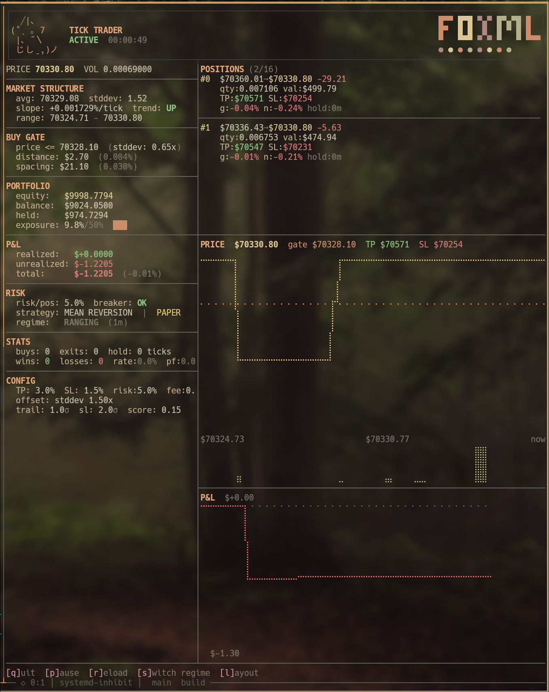

# Tick Trader

Tick-level crypto trading engine in C++. Branchless fixed-point arithmetic, bitmap-based portfolio management, regime-adaptive strategy switching. Single-symbol, single-threaded hot path with multicore TUI dashboard.



## Quick Start

```bash
make          # build (ANSI TUI, zero deps beyond OpenSSL)
make run      # build + run (connects to Binance, paper trades BTC)
make test     # run 128 tests
```

The engine binary lives in `build/` and reads `engine.cfg` from its working directory (symlinked by `make`).

## Architecture

```
HOT PATH (every tick, p50 ~950ns, min ~60ns):
  BuyGate          direction-aware price+volume check     (~80ns avg)
  PositionExitGate branchless bitmap walk, TP/SL per pos  (~130ns/pos)
  FillConsumption  strategy-aware sizing, risk checks      (~750ns avg, ~4us on fill)

SLOW PATH (every 100 ticks):
  RegimeDetector   classify RANGING/TRENDING/VOLATILE
  StrategyDispatch adapt + buy signal (MR or momentum)
  RollingStats     128-tick + 512-tick market statistics
  TradeLog         buffered CSV drain
  Snapshot         binary state persistence (v7)
```

## Strategies

### Mean Reversion (RANGING regime)
- **Entry:** buy when price dips below rolling average (stddev-scaled offset)
- **Exit:** per-position TP/SL, trailing TP (SNR×R² gated), time-based exit
- **Adaptation:** P&L regression loosens/tightens entry filters
- **Volume spikes:** 5x+ volume spike halves entry spacing (tighter clustering on high-conviction dips)

### Momentum (TRENDING regime)
- **Entry:** buy when price breaks above rolling average + stddev offset
- **Exit:** adaptive TP/SL (R²-scaled: high R² widens TP, ROR acceleration adds 20% bonus)
- **Adaptation:** P&L regression adjusts breakout threshold

### Risk Controls
- **Post-SL cooldown:** pauses buying for N cycles after stop loss (prevents falling knife entries)
- **Circuit breaker:** halts trading if total P&L exceeds max drawdown
- **Exposure limit:** caps total deployed capital as percentage of balance

### Regime Detection (score-based)
- **RANGING** → mean reversion (buy dips)
- **TRENDING** → momentum (buy breakouts)
- **VOLATILE** → pause buying (existing positions keep TP/SL)
- 7 input signals via `RegimeSignals` struct:
  - Short/long slope magnitude (128-tick + 512-tick windows)
  - R² consistency (least-squares regression fit)
  - ROR slope (trend acceleration — slope-of-slopes)
  - Volume slope confirmation
  - Vol ratio (short/long variance — volatility spike detection)
- Weighted scoring: trending needs 2/5 signals, volatile needs 2/2
- Hysteresis prevents rapid switching (configurable cycles)
- Position TP/SL adjusted on regime transition

## Adding a New Strategy

1. Create `Strategies/NewStrategy.hpp` — implement Init, Adapt, BuySignal, ExitAdjust
2. Add `STRATEGY_NEW = 2` to `StrategyInterface.hpp`
3. Add case to `Strategy_Dispatch` switch in `PortfolioController.hpp`
4. Add case to `PortfolioController_Unpause` switch
5. Add config fields + defaults to `ControllerConfig.hpp`
6. Map regime → strategy in `Regime_ToStrategy` (if applicable)

No duplicate code to sync — shared functions handle config reload, unpause, and regime cycling.

## Build

Requires: g++ (C++17), OpenSSL, CMake 3.14+. Default build has zero external TUI dependencies.

```bash
make              # build (ANSI TUI, no library deps)
make run          # build + run engine
make test         # run 101 tests
make ftxui        # build with FTXUI TUI (auto-fetched)
make notcurses    # build with notcurses TUI (requires system lib)
make profile      # with per-component latency profiling
make profile-lite # total-only latency (lower overhead)
make bench        # headless profiling to stderr
make clean        # remove build directory
```

Or directly with CMake:

```bash
cmake -B build && cmake --build build                       # ANSI TUI (default)
cmake -B build -DUSE_FTXUI=ON && cmake --build build        # FTXUI TUI (auto-fetched)
cmake -B build -DUSE_NOTCURSES=ON && cmake --build build    # notcurses TUI (requires system lib)
```

### CMake Options

| Option | Default | Effect |
|--------|---------|--------|
| `USE_FTXUI` | OFF | Use FTXUI for TUI (auto-fetched from GitHub) |
| `USE_NOTCURSES` | OFF | Use notcurses for TUI (requires system lib) |
| `LATENCY_PROFILING` | OFF | RDTSCP timing with per-component breakdown |
| `LATENCY_LITE` | OFF | Total-only timing (2 rdtscp vs 4) |
| `LATENCY_BENCH` | OFF | Headless profiling to stderr |

## TUI

Zero-dependency ANSI terminal dashboard with FoxML warm-forest color palette (truecolor).
Engine runs on core 0, TUI renders on core 1 from a double-buffered snapshot (zero engine contention).
Designed for transparent terminals — foreground-only colors, synchronized output protocol for flicker-free rendering.

Three backends available:
- **ANSI** (default) — raw escape codes, no library deps, works everywhere including tmux
- **FTXUI** (`-DUSE_FTXUI=ON`) — DOM-based rendering, auto-fetched
- **notcurses** (`-DUSE_NOTCURSES=ON`) — experimental, requires system lib

Features:
- 3 preset layouts: Standard, Charts, Compact (cycle with `l`)
- Regime signal dashboard: R² bars, vol_ratio, ror_slope with directional arrows
- Price + P&L sparkline charts (▁▂▃▄▅▆▇█ from 120-point ring buffer)
- Position list with TP/SL, hold time, trailing status
- Exposure, regime classification with duration, strategy display
- Auto-resizes to terminal dimensions

## TUI Controls

| Key | Action |
|-----|--------|
| `q` | Quit (saves positions to snapshot) |
| `p` | Pause/unpause buying (exit gate keeps running) |
| `r` | Hot-reload engine.cfg |
| `s` | Cycle regime (RANGING→TRENDING→VOLATILE) for testing |
| `l` | Cycle layout (Standard→Charts→Compact) |

## Project Structure

```
CoreFrameworks/
  OrderGates.hpp          BuyGate (direction-aware), SellGate
  Portfolio.hpp            Position storage, ExitGate, bitmap ops
  PortfolioController.hpp  Tick function, dispatch, shared functions, snapshot v7
  ControllerConfig.hpp     Config struct, parser, defaults

Strategies/
  StrategyInterface.hpp    Strategy contract + enum definitions
  MeanReversion.hpp        Buy dips, stddev-scaled offset, P&L adaptation
  Momentum.hpp             Buy breakouts, trend-following, tighter SL
  RegimeDetector.hpp       Market classification + position adjustment

DataStream/
  BinanceCrypto.hpp        WebSocket stream (TCP/TLS/WS/JSON)
  EngineTUI.hpp            Terminal dashboard, multicore snapshot
  TUIAnsi.hpp              ANSI TUI renderer (default, zero deps)
  TUIWidgets/TUILayout.hpp FTXUI widgets/layouts (opt-in)
  TUINotcurses.hpp         notcurses renderer (experimental)
  TradeLog.hpp             CSV logger + ring buffer

FixedPoint/
  FixedPointN.hpp          Arbitrary-width fixed-point arithmetic
  FixedPoint64.hpp         Static 128-bit FP (experimental)

ML_Headers/
  RollingStats.hpp         Price/volume moving avg, stddev, slope
  LinearRegression3X.hpp   3-sample rolling regression
  ROR_regressor.hpp        Slope-of-slopes (second derivative)

DOCS/
  CHANGELOG.md             Version history
  NEXT_STEPS.md            Roadmap (prioritized)
  ARCHITECTURE.md          System design
  CONFIGURATION.md         All config keys
  PERFORMANCE.md           Hot-path optimization guide
  LATENCY_PROFILING.md     Measurement guide
  FUTURE_AUTOTUNE.md       Regime threshold auto-tuning (planned)
  FUTURE_VOLATILE_STRATEGY.md  Volatile regime strategy (planned)
```

## Docs

- `DOCS/CONTRIBUTING.md` — guide for adding strategies and extending the engine
- `DOCS/CHANGELOG.md` — version history
- `DOCS/NEXT_STEPS.md` — roadmap with completed/remaining items
- `DOCS/ARCHITECTURE.md` — system design and data flow
- `DOCS/CONFIGURATION.md` — all config keys
- `DOCS/PERFORMANCE.md` — hot-path breakdown, optimization guide
- `DOCS/LATENCY_PROFILING.md` — measurement guide and build modes
- `engine.cfg` — annotated config with all parameters
