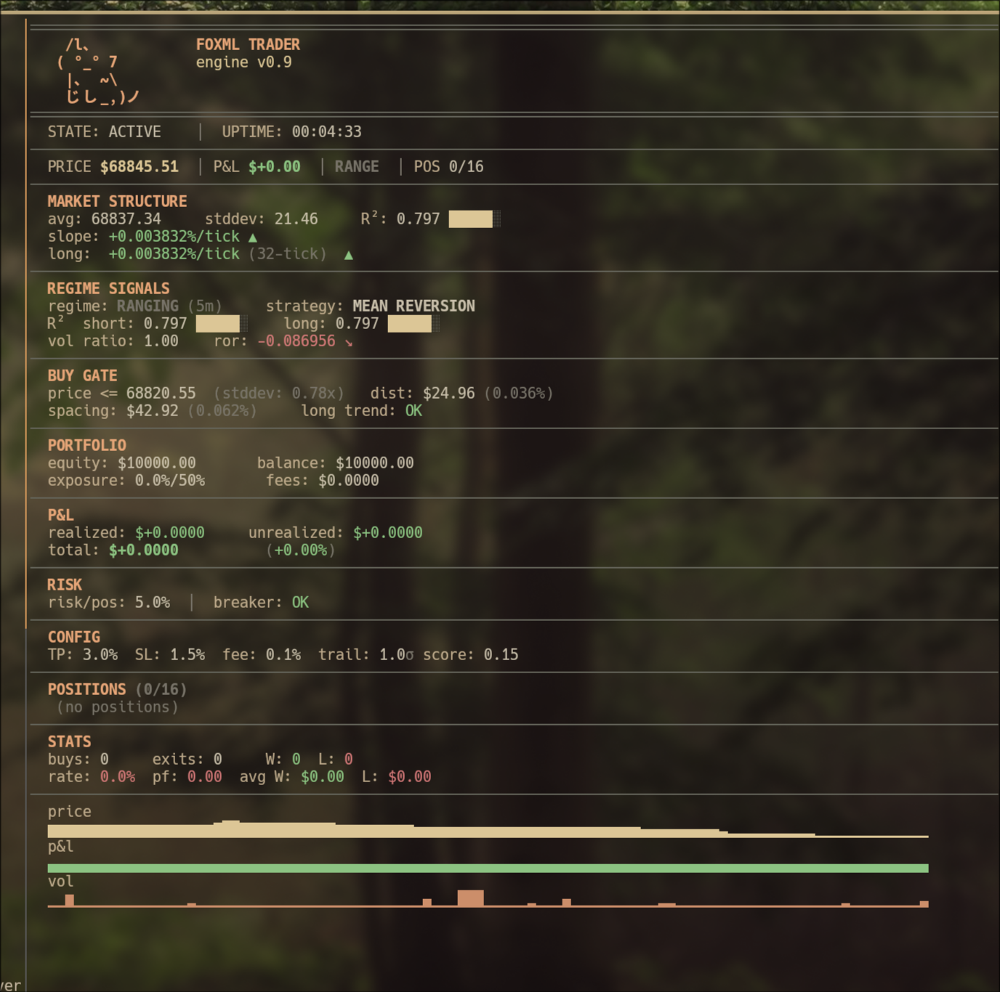
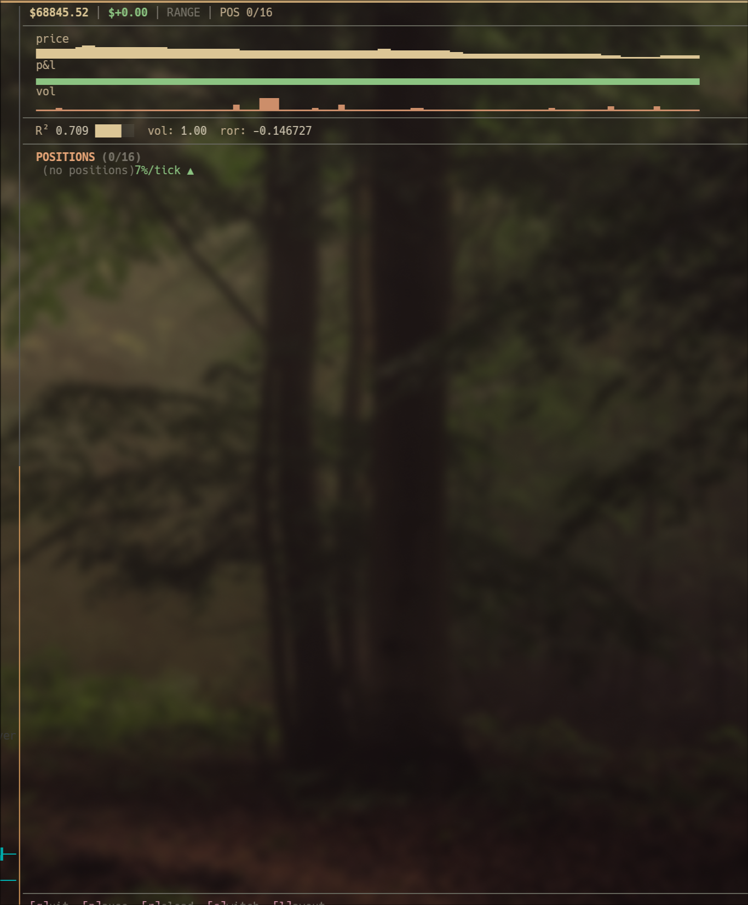

# Tick Trader

**Copyright (c) 2026 Jennifer Lewis. All rights reserved.**

This software is dual-licensed: [AGPL-3.0-or-later](LICENSE) or Commercial. If you use this software without complying with the AGPL (including the requirement to publish your source code for any network-accessible deployment) and without a commercial license, you are infringing copyright.

**Unauthorized Use — Settlement Terms:** 10% of gross revenue from date of first unauthorized use + flat fee TBD. Full statutory damages under 17 U.S.C. § 504 (up to $150,000 per work for willful infringement). **Bounty:** 33% of net recovery for reports leading to successful settlement. Contact: [jenn.lewis5789@gmail.com](mailto:jenn.lewis5789@gmail.com)

---

Tick-level crypto trading engine in C++17. Branchless fixed-point arithmetic, bitmap-based portfolio management, regime-adaptive strategy switching with score-based market classification. Sub-microsecond hot path, multicore TUI dashboard, zero external dependencies.

> **Paper trading by default.** Live trading via Binance REST API is supported (Binance US or global). Set `use_real_money=1` + `use_binance_us=1` in engine.cfg and add API keys to `secrets.cfg`. No API key needed for market data — the public websocket is always used for price feeds.

> **WARNING: Live trading is experimental.** Use at your own risk. This software is provided as-is with no warranty. The authors are not responsible for any financial losses. Start with micro position sizes and never risk money you can't afford to lose.

> **Note:** With `max_positions=1` (default), the engine sells your entire BTC balance on exit, eliminating dust from quantity rounding. Startup recovery also sweeps any orphaned BTC from prior sessions. With `max_positions > 1`, small dust may still accumulate — periodically convert via the Binance dashboard (Trade → Convert Small Assets).

[](https://www.paypal.com/ncp/payment/8M6XLK7M8569C) [](https://discord.gg/asSDcYwPz)

### Standard Layout


### Charts Layout


## Requirements

- **CPU:** x86-64 with L1 D-cache (any modern Intel/AMD — hot path fits in ~3KB)
- **RAM:** 1GB minimum (engine uses ~50MB including rolling stats and TUI)
- **OS:** Linux (kernel 4.x+, tested on Arch)
- **Compiler:** g++ with C++17 support
- **Libraries:** OpenSSL (libssl, libcrypto), pthreads
- **Network:** internet connection for Binance websocket + REST API
- **Optional:** `constant_tsc` CPU flag for accurate latency profiling (standard on all modern CPUs)

## Quick Start

```bash
cp engine.cfg.example engine.cfg   # create your config from template
make                               # build (ANSI TUI, zero deps beyond OpenSSL)
make run                           # build + connect to Binance, paper trade BTC
make test                          # run 134 tests
```

Requires: g++ (C++17), OpenSSL, CMake 3.14+. No other dependencies.

## What This Does

The engine connects to Binance's public websocket, receives real-time BTC/USDT trade data, and makes paper trading decisions on every tick:

1. **Classify the market** — score-based regime detection (RANGING / TRENDING / VOLATILE) using 7 signals: multi-timeframe slope, R² consistency, trend acceleration, volume confirmation, volatility ratio
2. **Pick a strategy** — mean reversion for ranging markets (buy dips), momentum for trending markets (buy breakouts), pause for volatile
3. **Manage positions** — up to 16 concurrent positions with per-position TP/SL, trailing stops, adaptive entry spacing, volume spike detection
4. **Control risk** — circuit breaker on max drawdown, exposure limits, post-SL cooldown to prevent catching falling knives

## Architecture

```
HOT PATH (every tick, p50 ~950ns, min ~62ns):
  BuyGate          branchless price+volume gate           (~62ns min)
  PositionExitGate bitmap walk, per-position TP/SL        (~130ns/pos)
  FillConsumption  sizing, spacing, risk checks            (~750ns avg)

SLOW PATH (every 100 ticks):
  RollingStats     128-tick + 512-tick least-squares regression
  RegimeDetector   7-signal score → RANGING/TRENDING/VOLATILE
  StrategyDispatch adapt parameters + generate buy signal
  TradeLog         buffered CSV drain
  Snapshot         binary state persistence (v7)
```

All hot-path math uses arbitrary-width fixed-point arithmetic (`FPN<64>` = 4096-bit precision). No floating point on the critical path. Branchless patterns throughout: mask tricks with `-(uint64_t)condition`, word-level mask-select.

## Strategies

### Mean Reversion (RANGING regime)
- **Entry:** price dips below rolling average (stddev-scaled offset, P&L regression-adapted)
- **Exit:** per-position TP/SL, trailing TP (SNR×R² gated), time-based exit
- **Volume spikes:** 5x+ spike halves entry spacing for tighter clustering on high-conviction dips

### Momentum (TRENDING regime)
- **Entry:** price breaks above rolling average + stddev offset
- **Exit:** adaptive TP/SL — R²-scaled multipliers (high R² widens TP), ROR acceleration bonus (+20%)
- **Adaptation:** P&L regression adjusts breakout threshold

### Regime Detection
7 input signals feed a weighted scoring system with hysteresis:

| Signal | Source | What it measures |
|--------|--------|-----------------|
| Short slope | 128-tick regression | Recent price direction |
| Long slope | 512-tick regression | Broader trend |
| Short R² | 128-tick regression | Trend consistency |
| ROR slope | Slope-of-slopes | Trend acceleration |
| Volume slope | 128-tick regression | Volume trend |
| Vol ratio | Short/long variance | Volatility spike |
| Volume confirmation | Slope + volume | Compound signal |

Trending needs 2/5 signals. Volatile needs 2/2. Hysteresis prevents rapid switching.

### Risk Controls
- **Post-SL cooldown** — pauses buying for N cycles after stop loss
- **Circuit breaker** — halts trading if P&L exceeds max drawdown
- **Exposure limit** — caps deployed capital as % of balance
- **Entry spacing** — prevents position clustering at same price
- **Volume spike spacing** — relaxes spacing on high-conviction volume surges
- **Fill rejection diagnostics** — tracks why fills are rejected (spacing, balance, exposure, breaker)

## TUI

Zero-dependency ANSI terminal dashboard with warm-forest color palette (truecolor). Engine runs on core 0, TUI renders on core 1 from a double-buffered snapshot (zero engine contention). Diff-based rendering — unchanged content is never touched.

Features:
- 3 layouts: Standard, Charts, Compact (cycle with `l`)
- Regime signals: R² bars, vol_ratio, ror_slope with directional arrows
- Sparkline charts: price, P&L (per-bar green/red), volume (▁▂▃▄▅▆▇█)
- Adaptive position list: expanded (≤4 positions) or compact (≥5)
- Fill rejection diagnostics, session high/low, trading blocked indicator
- Auto-resizes to terminal dimensions

| Key | Action |
|-----|--------|
| `q` | Quit (saves positions to snapshot) |
| `p` | Pause/unpause buying |
| `r` | Hot-reload engine.cfg |
| `s` | Cycle regime for testing |
| `l` | Cycle layout |

## Build

```bash
make              # ANSI TUI (default, no library deps)
make run          # build + run
make test         # run 134 tests
make ftxui        # FTXUI TUI (auto-fetched)
make notcurses    # notcurses TUI (requires system lib)
make profile      # with RDTSCP latency profiling
make clean        # remove build directory
```

Or with CMake directly:

```bash
cmake -B build && cmake --build build                       # ANSI TUI
cmake -B build -DUSE_FTXUI=ON && cmake --build build        # FTXUI
cmake -B build -DUSE_NOTCURSES=ON && cmake --build build    # notcurses
```

## Configuration

Copy `engine.cfg.example` to `engine.cfg` and edit. All parameters are documented in the file. Hot-reloadable with `r` in the TUI (except symbol, warmup_ticks).

Key parameters:
- `take_profit_pct` / `stop_loss_pct` — base TP/SL as percentage
- `momentum_tp_mult` / `momentum_sl_mult` — stddev multipliers for momentum strategy
- `spike_threshold` — volume spike ratio to trigger spacing relaxation
- `slippage_pct` — simulated execution slippage (%, 0 = disabled)
- `sl_cooldown_cycles` — slow-path cycles to pause after stop loss
- `min_warmup_samples` — slow-path samples required before trading starts
- `regime_r2_threshold` — R² required for TRENDING classification

See `DOCS/CONFIGURATION.md` for the full reference.

## Project Structure

```
CoreFrameworks/          Portfolio, OrderGates, PortfolioController, Config
Strategies/              MeanReversion, Momentum, RegimeDetector, StrategyInterface
DataStream/              BinanceCrypto (websocket), TUI renderers, TradeLog
FixedPoint/              Arbitrary-width fixed-point arithmetic library
ML_Headers/              RollingStats, LinearRegression, ROR regressor
MemHeaders/              PoolAllocator, BuddyAllocator
tests/                   134 assertions across 25 test functions
DOCS/                    Architecture, configuration, performance, changelogs
```

## Adding a Strategy

1. Create `Strategies/NewStrategy.hpp` — implement Init, Adapt, BuySignal, ExitAdjust
2. Add `STRATEGY_NEW = 2` to `StrategyInterface.hpp`
3. Add case to dispatch switch in `PortfolioController.hpp`
4. Add config fields + defaults to `ControllerConfig.hpp`
5. Map regime → strategy in `Regime_ToStrategy`

See `DOCS/CONTRIBUTING.md` for the full guide.

## License

AGPL-3.0-or-later or Commercial. See top of this file for full terms.

---

<a href="https://www.paypal.com/ncp/payment/8M6XLK7M8569C">
  
</a>
